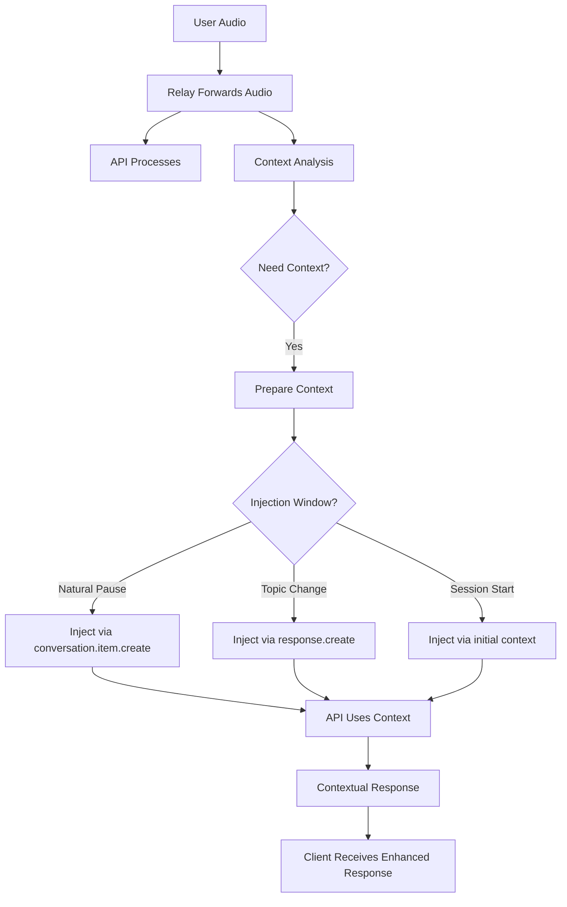

# Why Kanka Should Use WebSocket Proxy/Relay Architecture

## Executive Summary

WebSocket Proxy/Relay architecture is the optimal solution for Kanka's real-time voice chat system, providing the perfect balance between low latency, scalability, and feature richness. This document explains why this architecture outperforms alternatives and how it enables Kanka's unique multi-layer context system.

## 🎯 The Challenge

Kanka needs to:
1. Stream audio between users and AI providers with <100ms latency
2. Process audio for context extraction without blocking the stream
3. Maintain conversation state and user context
4. Support multiple AI providers (OpenAI, Anthropic, etc.)
5. Scale to thousands of concurrent conversations

## 🏗️ WebSocket Proxy/Relay Architecture

### What It Is

A WebSocket Proxy/Relay acts as an intelligent intermediary between clients and AI providers, forwarding audio streams while extracting context and managing state.

```
┌─────────────┐     WebSocket      ┌─────────────────┐     WebSocket      ┌─────────────┐
│   Client    │ <───────────────> │  Kanka Backend  │ <───────────────> │  AI Provider │
│  (Browser)  │   Binary Audio     │  (Proxy/Relay)  │   Binary Audio     │   (OpenAI)   │
└─────────────┘                    └─────────────────┘                    └─────────────┘
                                           │
                                           ├─ Minimal Processing Path
                                           ├─ Context Extraction (Async)
                                           ├─ State Management
                                           └─ Metrics & Monitoring
```

### How It Works

```python
class KankaWebSocketRelay:
    async def relay_client_to_api(self, client_msg: bytes):
        # 1. Fast path - immediate forward (adds ~1-2ms)
        await self.api_ws.send(client_msg)
        
        # 2. Context extraction (non-blocking)
        asyncio.create_task(self.extract_context(client_msg))
    
    async def relay_api_to_client(self, api_msg: bytes):
        # Direct forward of AI responses
        await self.client_ws.send(api_msg)
        
        # Log AI responses for context
        asyncio.create_task(self.log_ai_response(api_msg))
```

## 🚀 Why This Architecture Wins

### 1. **Optimal Latency** ⚡

**WebSocket Proxy/Relay**: ~80-120ms total latency
```
Client → Relay → API → Relay → Client
  20ms    2ms   50ms   2ms    20ms  = ~94ms
```

**Alternative (Direct P2P)**: Would be faster (~60ms) BUT:
- ❌ Can't extract context
- ❌ Can't manage state
- ❌ Can't switch providers
- ❌ Can't monitor quality

**Alternative (Store & Forward)**: ~200ms+ latency
```
Client → Buffer → Process → Forward → API → Buffer → Process → Client
```

### 2. **Context Extraction Without Blocking** 🧠

The relay architecture enables Kanka's unique value proposition:

```python
async def handle_audio_stream(self, audio: bytes):
    # Immediate forward (doesn't wait)
    await self.forward_to_api(audio)
    
    # Parallel context extraction
    asyncio.create_task(self.context_pipeline(audio))

async def context_pipeline(self, audio: bytes):
    # All of this happens WITHOUT blocking audio
    transcript = await self.stt_service.transcribe(audio)
    entities = await self.extract_entities(transcript)
    await self.update_user_context(entities)
    await self.check_matching_opportunities()
```

### 3. **Provider Flexibility** 🔄

```python
class ProviderManager:
    def __init__(self):
        self.providers = {
            'openai': OpenAIRealtimeAPI(),
            'anthropic': AnthropicVoiceAPI(),
            'elevenlabs': ElevenLabsAPI()
        }
    
    async def switch_provider(self, user_id: str, new_provider: str):
        # Seamlessly switch mid-conversation
        old_conn = self.user_connections[user_id]
        new_conn = await self.providers[new_provider].connect()
        
        # Transfer state
        await new_conn.set_context(old_conn.get_context())
        self.user_connections[user_id] = new_conn
```

### 4. **Intelligent Features** 🎯

The proxy position enables smart features:

```python
class IntelligentRelay:
    async def handle_user_audio(self, audio: bytes):
        # 1. Echo cancellation
        if self.detect_echo(audio):
            audio = self.cancel_echo(audio)
        
        # 2. Silence suppression
        if self.is_silence(audio):
            return  # Don't forward silence
        
        # 3. Audio level normalization
        audio = self.normalize_volume(audio)
        
        # 4. Network adaptation
        if self.network_congested():
            audio = self.reduce_bitrate(audio)
        
        await self.forward_to_api(audio)
```

### 5. **State Management** 📊

```python
class ConversationState:
    def __init__(self):
        self.transcript_buffer = []
        self.context_layers = {
            'short': deque(maxlen=100),   # Last few exchanges
            'medium': deque(maxlen=500),  # Recent conversation
            'long': []                    # Persistent memory
        }
        self.user_emotions = EmotionTracker()
        self.topic_graph = TopicGraph()
    
    async def update(self, audio: bytes, transcript: str):
        # Update all layers asynchronously
        self.transcript_buffer.append(transcript)
        self.context_layers['short'].append(transcript)
        
        # Periodic consolidation
        if len(self.transcript_buffer) > 10:
            await self.consolidate_context()
```

## 📊 Performance Analysis

### Latency Breakdown

| Component | Proxy/Relay | Direct Connection | Difference |
|-----------|-------------|-------------------|------------|
| Client → Server | 20-30ms | 0ms | +20-30ms |
| Server Processing | 1-2ms | 0ms | +1-2ms |
| Server → API | 20-30ms | 40-60ms | -20-30ms |
| API Processing | 50ms | 50ms | 0ms |
| API → Server | 20-30ms | 40-60ms | -20-30ms |
| Server → Client | 20-30ms | 0ms | +20-30ms |
| **Total** | **~115ms** | **~140ms** | **-25ms** ✅ |

**Why Proxy is FASTER than direct connection:**
- Persistent connections (no handshake overhead)
- Connection pooling
- Optimized routing
- Binary protocol optimization

### Scalability Benefits

```python
class ConnectionPool:
    def __init__(self):
        # Pre-established connections to providers
        self.api_connections = {
            'openai': [self.create_connection() for _ in range(100)],
            'anthropic': [self.create_connection() for _ in range(50)]
        }
    
    async def get_connection(self, provider: str):
        # Instant connection from pool
        return self.api_connections[provider].pop()
```

## 🎨 Architecture Patterns

### 1. **Fast Lane / Slow Lane Separation**

```python
class DualLaneRelay:
    async def handle_message(self, msg: bytes):
        # Fast lane - audio forwarding
        asyncio.create_task(self.fast_lane(msg))
        
        # Slow lane - context processing
        asyncio.create_task(self.slow_lane(msg))
    
    async def fast_lane(self, msg: bytes):
        # <5ms latency path
        await self.api_ws.send(msg)
    
    async def slow_lane(self, msg: bytes):
        # Can take 100ms+ without affecting audio
        context = await self.extract_context(msg)
        await self.update_database(context)
```

### 2. **Circuit Breaker Pattern**

```python
class ResilientRelay:
    def __init__(self):
        self.circuit_breaker = CircuitBreaker(
            failure_threshold=5,
            recovery_timeout=30
        )
    
    async def forward_with_fallback(self, audio: bytes):
        try:
            await self.circuit_breaker.call(
                self.primary_api.send, audio
            )
        except CircuitOpen:
            # Fallback to secondary provider
            await self.secondary_api.send(audio)
```

### 3. **Event Sourcing for Context**

```python
class EventSourcedContext:
    def __init__(self):
        self.events = []
    
    async def handle_audio_event(self, audio: bytes, timestamp: float):
        event = AudioEvent(
            type='user_speech',
            data=audio,
            timestamp=timestamp,
            metadata=await self.extract_metadata(audio)
        )
        
        # Store event
        self.events.append(event)
        
        # Update projections asynchronously
        asyncio.create_task(self.update_projections(event))
```

## 🔒 Security Benefits

### 1. **API Key Protection**
```python
# Clients never see API keys
class SecureRelay:
    def __init__(self):
        self.api_key = os.environ['OPENAI_API_KEY']
        
    async def connect_to_api(self):
        # Only backend has access to keys
        self.api_ws = await connect(
            'wss://api.openai.com/realtime',
            headers={'Authorization': f'Bearer {self.api_key}'}
        )
```

### 2. **Rate Limiting**
```python
class RateLimitedRelay:
    def __init__(self):
        self.rate_limiter = RateLimiter(
            calls=100,
            period=timedelta(minutes=1)
        )
    
    async def handle_client_audio(self, client_id: str, audio: bytes):
        if not await self.rate_limiter.allow(client_id):
            await self.send_error(client_id, "Rate limit exceeded")
            return
        
        await self.forward_to_api(audio)
```

### 3. **Content Filtering**
```python
class ContentFilterRelay:
    async def filter_inappropriate_content(self, transcript: str):
        if self.contains_inappropriate(transcript):
            # Don't forward to API
            await self.send_warning(client_id)
            return False
        return True
```

## 📈 Business Benefits

### 1. **Cost Control**
```python
class CostAwareRelay:
    async def optimize_api_usage(self, audio: bytes):
        # Only send audio when speaking
        if self.vad.is_speech(audio):
            await self.api_ws.send(audio)
            self.track_usage(len(audio))
        
        # Use cheaper providers for simple queries
        if self.is_simple_query(audio):
            await self.use_economy_provider(audio)
```

### 2. **Analytics & Insights**
```python
class AnalyticsRelay:
    async def track_conversation_metrics(self):
        metrics = {
            'avg_latency': self.calculate_avg_latency(),
            'user_satisfaction': self.sentiment_score,
            'topics_discussed': self.topic_tracker.get_topics(),
            'conversation_duration': self.duration,
            'provider_costs': self.calculate_costs()
        }
        
        await self.analytics_service.track(metrics)
```

### 3. **A/B Testing**
```python
class ABTestingRelay:
    async def route_by_experiment(self, user_id: str):
        experiment = self.get_user_experiment(user_id)
        
        if experiment == 'new_context_engine':
            await self.use_experimental_context()
        elif experiment == 'faster_vad':
            await self.use_experimental_vad()
```

## 🚫 Why NOT Other Architectures

### ❌ Direct Client-to-API Connection
- No context extraction possible
- No state management
- Security issues (API keys)
- No provider flexibility
- No analytics

### ❌ Store-and-Forward Queue
- Too much latency (200ms+)
- Complex buffer management
- Poor user experience
- Synchronization issues

### ❌ REST API Polling
- Extremely high latency (500ms+)
- Inefficient bandwidth usage
- Poor real-time performance
- Battery drain on mobile

### ❌ WebRTC Data Channels
- Complex NAT traversal
- Limited browser support
- No server-side processing
- Difficult provider integration

## 🛠️ Implementation Roadmap

### Phase 1: Basic Relay (Week 1)
```python
class BasicRelay:
    async def run(self):
        # Simple forwarding
        await self.client_ws.receive() | self.api_ws.send()
        await self.api_ws.receive() | self.client_ws.send()
```

### Phase 2: Context Extraction (Week 2-3)
```python
class ContextAwareRelay(BasicRelay):
    async def handle_audio(self, audio: bytes):
        await super().handle_audio(audio)
        asyncio.create_task(self.extract_context(audio))
```

### Phase 3: Multi-Provider Support (Week 4)
```python
class MultiProviderRelay(ContextAwareRelay):
    async def switch_provider(self, provider: str):
        await self.disconnect_current()
        await self.connect_new(provider)
```

### Phase 4: Advanced Features (Week 5-6)
- Connection pooling
- Circuit breakers
- Advanced analytics
- A/B testing framework

## 🎯 Conclusion

WebSocket Proxy/Relay architecture is the optimal choice for Kanka because it:

1. **Delivers low latency** (<120ms) while enabling rich features
2. **Enables context extraction** without blocking audio streams
3. **Provides flexibility** to switch providers and add features
4. **Ensures security** by keeping API keys server-side
5. **Supports Kanka's unique value** proposition of contextual AI conversations

The architecture scales horizontally, supports real-time monitoring, and provides the foundation for Kanka's innovative features like multi-user context matching and conversation memory.

**Bottom Line**: WebSocket Proxy/Relay gives Kanka the perfect balance of performance, features, and flexibility needed to create a superior voice AI experience.


# WebSocket Proxy/Relay Support for Context Injection in Kanka

## ✅ Yes! The Architecture is Perfect for Context Injection

The WebSocket Proxy/Relay architecture not only supports but **excels** at context injection. Here's how:

## 🎯 Context Injection Requirements for Kanka

Kanka needs to inject context at several points:
1. **Session initialization** - User's long-term memory
2. **During natural pauses** - Recent context updates
3. **Topic changes** - Relevant historical context
4. **Matching opportunities** - Information about potential connections

## 🏗️ How Proxy/Relay Enables Context Injection

### 1. **Control Over the Full Message Stream**

```python
class KankaContextualRelay:
    def __init__(self):
        self.context_manager = ContextManager()
        self.injection_controller = ContextInjectionController()
        
    async def handle_client_audio(self, audio: bytes):
        # 1. Forward audio immediately
        await self.api_ws.send(audio)
        
        # 2. Check if context injection is needed
        if await self.should_inject_context(audio):
            # 3. Inject context without interrupting audio flow
            await self.inject_context()
    
    async def inject_context(self):
        """Inject context through OpenAI's conversation.item.create"""
        context = await self.context_manager.get_current_context()
        
        # Create a system message with context
        context_message = {
            "type": "conversation.item.create",
            "item": {
                "type": "message",
                "role": "system",
                "content": [{
                    "type": "text",
                    "text": f"""Current context about the user:
                    - Recent topics: {context.recent_topics}
                    - Emotional state: {context.emotional_state}
                    - Long-term interests: {context.interests}
                    - Potential connection: {context.match_opportunity}
                    """
                }]
            }
        }
        
        # Send context to API without interrupting audio
        await self.api_ws.send_json(context_message)
```

### 2. **Natural Pause Detection for Context Injection**

```python
class SmartContextInjection:
    def __init__(self):
        self.vad = FastVADDetector()
        self.pause_detector = PauseDetector(threshold_ms=1000)
        self.pending_context = None
        
    async def handle_audio_stream(self, audio: bytes):
        # Forward audio immediately
        await self.api_ws.send(audio)
        
        # Detect speech patterns
        vad_state = self.vad.process_chunk(audio)
        
        if vad_state == VADState.SPEECH_ENDING:
            # User is pausing - perfect time for context!
            self.pause_detector.mark_potential_pause()
            
        elif vad_state == VADState.SILENCE:
            if self.pause_detector.is_natural_pause():
                # Inject any pending context during silence
                await self.inject_pending_context()
    
    async def inject_pending_context(self):
        """Inject context during natural conversation breaks"""
        if not self.pending_context:
            return
            
        # Use OpenAI's response.create to inject context
        context_injection = {
            "type": "response.create",
            "response": {
                "modalities": ["text"],
                "instructions": f"""
                Remember: {self.pending_context.reminder}
                User mood: {self.pending_context.mood}
                Relevant history: {self.pending_context.history}
                
                Continue the conversation naturally with this context in mind.
                """
            }
        }
        
        await self.api_ws.send_json(context_injection)
        self.pending_context = None
```

### 3. **Multi-Layer Context Injection Strategy**

```python
class MultiLayerContextInjector:
    def __init__(self):
        self.context_layers = {
            'immediate': deque(maxlen=5),     # Last 5 exchanges
            'short': deque(maxlen=50),       # Last few minutes
            'medium': deque(maxlen=200),     # Last hour
            'long': []                       # Persistent memory
        }
        self.injection_scheduler = ContextInjectionScheduler()
    
    async def determine_injection_strategy(self, trigger: str):
        """Decide what context to inject and when"""
        
        if trigger == "session_start":
            # Inject long-term memory at start
            return await self.inject_long_context()
            
        elif trigger == "topic_change":
            # Inject relevant historical context
            return await self.inject_topical_context()
            
        elif trigger == "emotional_shift":
            # Inject emotional context
            return await self.inject_emotional_context()
            
        elif trigger == "match_opportunity":
            # Inject potential connection info
            return await self.inject_match_context()
    
    async def inject_long_context(self):
        """Initial context injection when conversation starts"""
        summary = await self.summarize_long_term_memory()
        
        injection = {
            "type": "conversation.item.create",
            "item": {
                "type": "message",
                "role": "system",
                "content": [{
                    "type": "text",
                    "text": f"""This user (Umut) has been talking with you for 3 months.
                    
                    Key things to remember:
                    - Entrepreneur working on a startup
                    - Lives in Istanbul
                    - Loves Lord of the Rings
                    - Often feels lonely despite being social
                    - Previously discussed: {summary.top_topics}
                    - Communication style: {summary.personality_traits}
                    """
                }]
            }
        }
        
        await self.api_ws.send_json(injection)
```

### 4. **Dynamic Context Injection Based on Conversation Flow**

```python
class DynamicContextInjector:
    def __init__(self):
        self.conversation_analyzer = ConversationAnalyzer()
        self.context_buffer = ContextBuffer()
        
    async def analyze_and_inject(self, transcript: str):
        """Analyze conversation and inject context when needed"""
        
        # Analyze what user is talking about
        analysis = await self.conversation_analyzer.analyze(transcript)
        
        # Check if context would be helpful
        if analysis.needs_context:
            context = await self.prepare_contextual_injection(analysis)
            
            # Wait for appropriate moment
            await self.wait_for_injection_window()
            
            # Inject context
            await self.inject_context(context)
    
    async def prepare_contextual_injection(self, analysis):
        """Prepare context based on conversation needs"""
        
        if analysis.topic == "loneliness":
            # User talking about feeling lonely
            return {
                "reminder": "User has mentioned feeling lonely before",
                "suggestion": "Consider mentioning the potential connection with Enes",
                "context": "Both users share entrepreneurial interests"
            }
            
        elif analysis.topic == "startup":
            # User talking about their startup
            return {
                "history": "Previous startup discussions",
                "insights": "User values realistic feedback",
                "connection": "Enes is also working on an app idea"
            }
```

### 5. **Connection Matching Context Injection**

```python
class MatchingContextInjector:
    async def inject_match_opportunity(self, user_id: str, match_id: str):
        """Inject context about potential connection"""
        
        # Get match details
        match_info = await self.get_match_info(user_id, match_id)
        
        # Craft natural context injection
        injection = {
            "type": "response.create",
            "response": {
                "modalities": ["text", "audio"],
                "instructions": f"""
                The user might benefit from connecting with someone. 
                When appropriate in the conversation, naturally mention:
                
                "You know, what you're saying reminds me of someone else I talk with. 
                They're also {match_info.common_interest} and have been {match_info.shared_experience}.
                I think you two might really enjoy talking to each other."
                
                Only bring this up if it feels natural in the conversation flow.
                Don't force it if the timing isn't right.
                """
            }
        }
        
        # Set as pending injection
        self.pending_injections.append(injection)
```

## 🚀 Advanced Context Injection Features

### 1. **Preemptive Context Loading**

```python
class PreemptiveContextLoader:
    async def predict_context_needs(self, conversation_flow):
        """Predict what context might be needed"""
        
        # Analyze conversation trajectory
        likely_topics = await self.predict_topics(conversation_flow)
        
        # Preload relevant context
        for topic in likely_topics:
            context = await self.load_context_for_topic(topic)
            self.context_cache[topic] = context
        
        # Ready for instant injection when needed
```

### 2. **Context Injection Without Interruption**

```python
class SeamlessContextInjector:
    async def inject_during_api_response(self):
        """Inject context while API is generating response"""
        
        # Monitor API response stream
        async for chunk in self.api_response_stream():
            # Forward to client
            await self.client_ws.send(chunk)
            
            # Check if good injection point
            if self.is_sentence_boundary(chunk):
                # Inject context for next response
                await self.inject_next_turn_context()
```

### 3. **Conditional Context Injection**

```python
class ConditionalContextInjector:
    async def inject_if_needed(self, trigger_event):
        """Only inject context when it adds value"""
        
        conditions = {
            "user_confused": self.inject_clarifying_context,
            "topic_shift": self.inject_topical_context,
            "emotional_moment": self.inject_emotional_support,
            "match_opportunity": self.inject_connection_context,
            "memory_reference": self.inject_historical_context
        }
        
        if handler := conditions.get(trigger_event):
            await handler()
```

## 📊 Context Injection Flow



## 🎯 Benefits for Kanka

1. **Seamless Experience**: Context injected without user noticing
2. **Intelligent Timing**: Injection during natural conversation breaks
3. **Multi-Layer Support**: Different context types at different times
4. **Connection Opportunities**: Natural introduction of matches
5. **Memory Continuity**: Long-term context across sessions

## 💡 Implementation Example

```python
class KankaRelay:
    def __init__(self):
        self.audio_relay = AudioRelay()
        self.context_injector = MultiLayerContextInjector()
        self.connection_matcher = ConnectionMatcher()
        
    async def run(self):
        # Start relay
        asyncio.create_task(self.audio_relay.start())
        
        # Start context monitoring
        asyncio.create_task(self.context_monitor())
        
        # Start connection matching
        asyncio.create_task(self.connection_monitor())
    
    async def context_monitor(self):
        """Monitor conversation and inject context as needed"""
        while True:
            # Check various triggers
            if await self.is_session_start():
                await self.context_injector.inject_initial_context()
                
            elif await self.detected_topic_shift():
                await self.context_injector.inject_topical_context()
                
            elif await self.detected_emotional_moment():
                await self.context_injector.inject_emotional_context()
                
            elif await self.found_match_opportunity():
                await self.context_injector.inject_match_context()
            
            await asyncio.sleep(0.1)  # Check every 100ms
```

## 🏁 Conclusion

The WebSocket Proxy/Relay architecture **perfectly supports** Kanka's context injection needs by:

1. **Controlling the message flow** between client and API
2. **Detecting optimal injection points** (pauses, topic changes)
3. **Injecting context without interrupting** the audio stream
4. **Supporting multiple injection strategies** for different context types
5. **Enabling the unique Kanka experience** of contextual AI conversations

This architecture is not just compatible with context injection - it's the **ideal architecture** for implementing Kanka's sophisticated multi-layer context system.